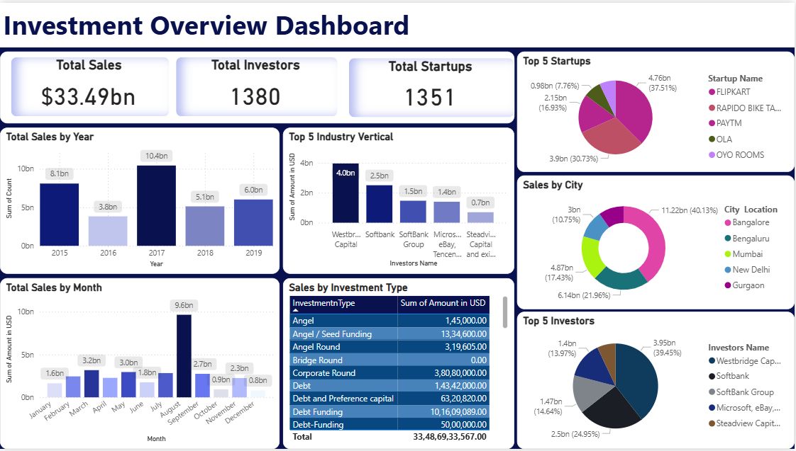

# 📊 Startup Investment Insights Dashboard – India

An interactive **Power BI dashboard** analyzing **Indian startup funding trends**.  
This project highlights **funding amounts, top investors, startup hubs, and industry verticals** — helping **investors, policymakers, and analysts** gain meaningful insights into India’s startup ecosystem.

---

## 🚀 Features

### 🔹 Key Metrics at a Glance
- **Total Funding:** $33.49B  
- **Total Investors:** 1,380  
- **Total Startups:** 1,351  

### 🔹 Trends & Patterns
- **Yearly Trends (2015–2019)** – Funding growth & decline  
- **Monthly Trends (Jan–Dec)** – Seasonality of investments  

### 🔹 Top 5 Analysis
- **Startups:** Flipkart, Rapido, Paytm, Ola, OYO Rooms  
- **Investors:** SoftBank, Westbridge Capital, Microsoft/eBay, etc.  
- **Industry Verticals:** E-commerce, Ride-hailing, Fintech, Hospitality  

### 🔹 Geographical Insights
- City-wise funding split across **Bangalore, Mumbai, New Delhi, Gurgaon**, etc.  

### 🔹 Investment Types
- Equity, Private Equity, Pre-Series A, Mezzanine, In-house Funding, etc.  

---

## 📈 Key Insights & Storytelling

- **Flipkart** dominates with ~37.5% of total funding → reflects strong investor trust in e-commerce.  
- **SoftBank** emerges as the most influential investor across multiple unicorns.  
- **Bangalore** captures **40%+** of startup investments → cementing its role as India’s startup hub.  
- **2017** was the peak year with **$10.4B funding**, while **August** saw the highest monthly deals (**$9.6B**).  
- Majority of funding comes from **Private Equity & Series A rounds**, highlighting ecosystem maturity.  

👉 **Takeaway:** E-commerce, ride-hailing, and fintech dominate investor attention, while **Bangalore remains the epicenter of India’s venture capital activity**.  

---

## 🛠 Tools & Technologies
- **Power BI** → Interactive data visualization  
- **Dataset** → [Indian Startup Funding Dataset](https://www.kaggle.com/datasets/sudalairajkumar/indian-startup-funding)  
- **Excel / CSV** → Preprocessing & cleaning  

---

## 📂 Repository Structure

├── data/ # Dataset (if shareable)
├── Startup Investment Dashboard.pbix # Power BI dashboard file
├── Dashboard.png # Dashboard preview image
├── README.md # Project documentation
└── LICENSE # MIT License

---

## 📸 Dashboard Preview  

---

## 📜 License
This project is licensed under the [MIT License](LICENSE).  

---

## 📧 Contact
👤 **Vedika Sankhe**  
🔗 [GitHub](https://github.com/VedikaSankhe) | [LinkedIn](https://www.linkedin.com/in/vedika-sankhe-707700317)  

⭐ *If you found this project useful, don’t forget to star the repo!*  
