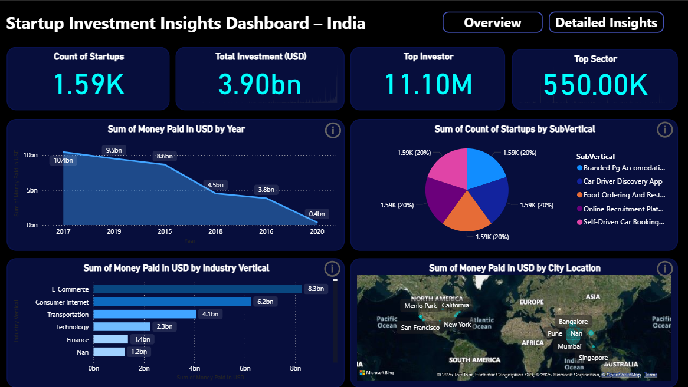
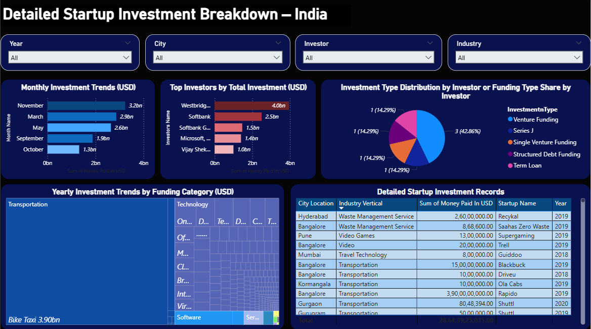

# 📊 Startup Investment Insights Dashboard – India

An interactive **Power BI dashboard** analyzing startup funding across India.  
This project provides insights into **investment trends, top investors, funding categories, industry verticals, and city-wise distribution**.

## 🚀 Features
- **Overview Page**:
  - Total startups, total investment, top investors, and top sectors.
  - Yearly trends of investments.
  - Sub-vertical distribution & city-wise insights.
- **Detailed Insights Page**:
  - Monthly and yearly investment breakdown.
  - Top investors by funding amount.
  - Funding type distribution.
  - City-wise & sector-wise details with a detailed table view.

## 🛠 Tools & Technologies
- **Power BI** – Data visualization
- **Dataset** – [Indian Startup Funding Dataset](https://www.kaggle.com/datasets/sudalairajkumar/indian-startup-funding)
- **Excel / CSV** – Data preprocessing

## 📂 Repository Files
- `Dashboard.pbix` – Power BI file.
- `Dashboard_Overview.png` – Overview dashboard preview.
- `Dashboard_Detailed.png` – Detailed insights dashboard preview.
- `README.md` – Project documentation.
- `LICENSE` – MIT License.

## 📸 Dashboard Preview
### **Overview Page**

### **Detailed Insights Page**

## 📜 License
This project is licensed under the [MIT License](LICENSE).

---

**Created by [Vedika Sankhe](https://www.linkedin.com/in/vedika-sankhe-707700317)**  
*If you like this project, don't forget to ⭐ the repository!*
